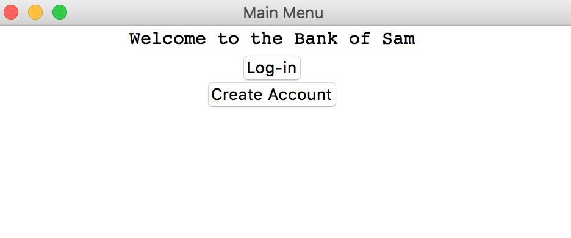
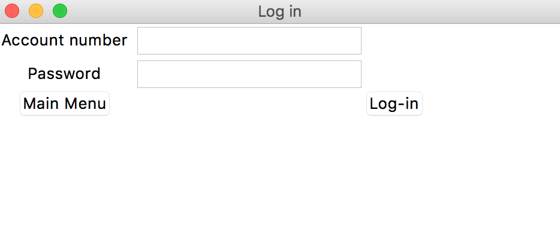
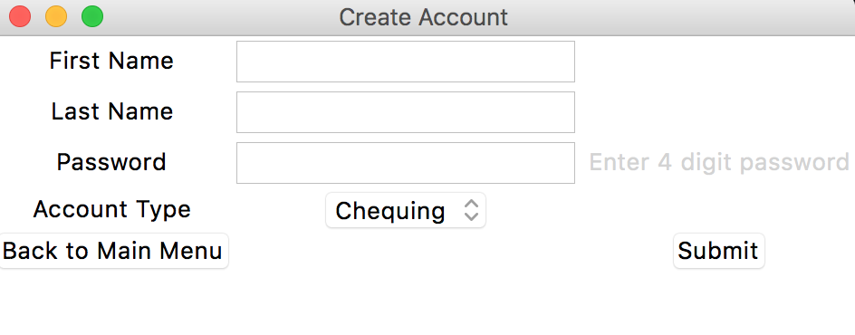
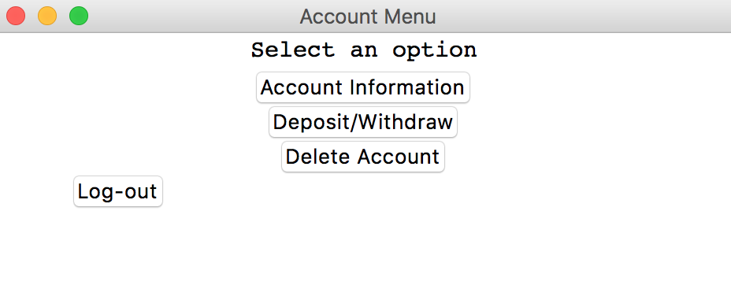
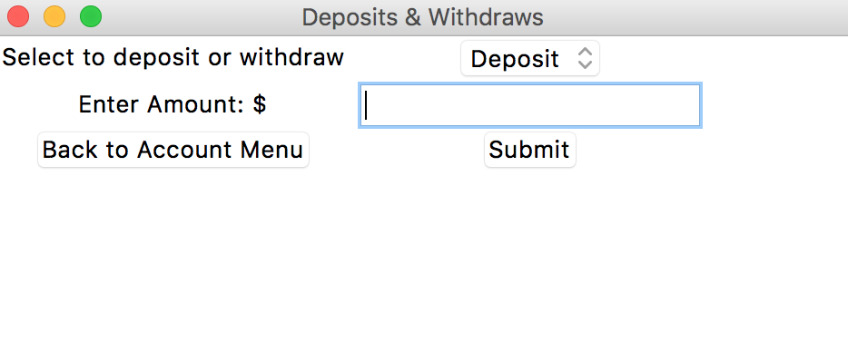
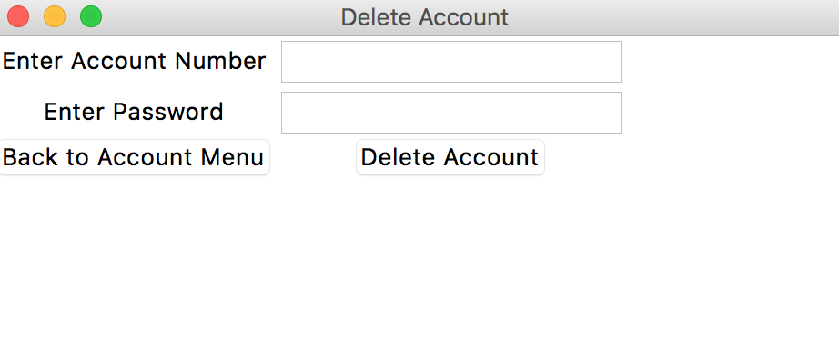

# Bank-Management-System
A banking system that uses the sqlite3 database system with a graphical user interface. Used for the creation, deletion, maintenance of user bank accounts that is stored in a ".db" file. Users are given an account number and they create a password which they can use to log in from time to time. Once logged in, users can view their acount information, deposit/withdraw from their account, or delete their account.
## Instructions
- Requirements: Python 3.9.1 or higher installed
- Clone the "Bank-Management-System" directory onto your system. 
- In the terminal, inside the directory run the command: 

          python3 Bank.py

- A GUI should appear on the screen for use.
- When finished using the program, make sure you are logged out and on the "Main Menu" screen before quitting.

## User Interface

